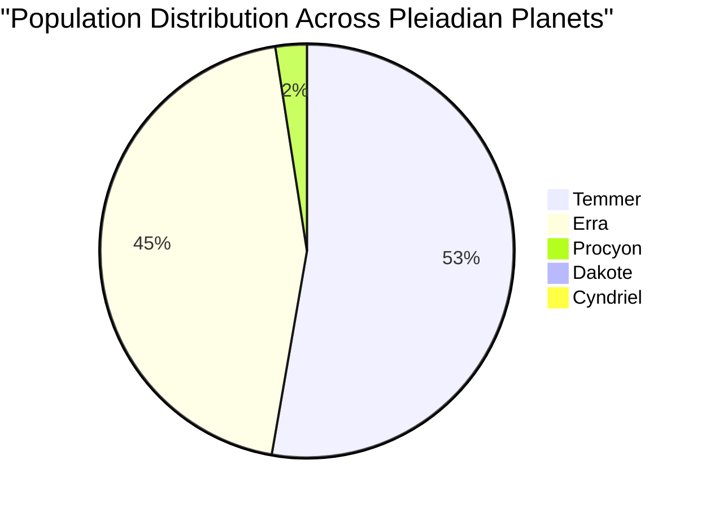

### *Note:*

*In my introduction, I've written that in my multi-crossover science fiction story, in general I will try to depict all the factions from their respective series as much lore-accurate as possible. Except when I feel like changing somethings. So generally I will stay true to the lore of the original series, except when I diverge from it on purpose, for plot armor reasons. Below is my explanation for one of these such occurences.*

*One of the series that I've put into my galaxy is the Star Gate series. We have seen the Goa'uld in my galaxy, and their interactions with the other factions. Now, not all of the Star Gate spacefaring civilizations will be featured in my science fiction story. Namely, I am omitting the Asgard. I have retconned them out of existence in this timeline. To be quite honest, I've never really liked them. It seems kind of weird to have "grey aliens" pretending to be Nordic gods.*

*Instead of the Asgard, I will be replacing them with a different faction. They are the Pleiadians, the literal Nordic gods, blond-haired, blue-eyes, elusive humanoids with immense spiritual powers. They are neither strictly humans nor are they elves, but they are a third cosmic race. They are the "good guys" in my story. Basically literal space wizards. They fill the role as the mentors of humanity.*

*With the Pleiadians, I will write their story more freely than with the other factions. I will make some stuff up, but will try to keep things as realistic as possible. For the Imperium of Man, the Galactic Empire, and the Goa'uld System Lords we have concentrated lore information in the wikis and elsewhere, lots of established lore. However there isn't that much established lore about the Pleiadians on the internet. What lore on the internet is often scattered throughout various disparate websites, and often contradicting each other. And I don't have enough time to go and read all of them. There is no canon text about the Pleiadians, so I will make my own. I will say although say that my Pleiadians faction are based on information written about them in the Biblioteca Pleyades and Universe People websites, and even then only loosely and since it's my science fiction story, I get to write it how I want. So this is an event where I diverge from the lore.*

---

Taygeta uses glowing crystals that are embedded into the walls, providing a warm lighting with no apparent source.

### Protagonist Profile
- **Name:** Ashtar Sheran
- **Race:** Pleiadian
- **Location:** the planet Taygeta, Pleiades star system
- **Age:** Unknown, estimated over 9,000 (insert Vegeta meme)
- **Mortality:** Perpetual
- **Known Abilities:** remote viewing, astral projection, mentat thinking, telepathy, telekinesis

Their spiritual leader, Ashtar Sheran is perhaps many thousands of years old, a truly ancient being rivaling the System Lords themselves. According to rumors, he was absent from Taygeta for a very prolonged period of time, and has returned only relatively recently. Where was he, what was he doing, only the Pleiadian High Elders know, but they keep their oath of silence.

### Protagonist Profile
- **Name:** Frieren
- **Race:** Elven
- **Location:** the planet , home of the Space Elves
- **Age:** Unknown, estimated as old as Ashtar
- **Mortality:** Perpetual
- **Known Abilities:** deeply intuitive, plant magic, spiritual healing, pure uncorruptible heart

### Protagonist Profile
- **Name:** Velarion
- **Race:** Elven
- **Location:** the planet , home of the Space Elves
- **Age:** 320
- **Mortality:** Mortal and elderly
- **Known Abilities:** attention, analytical thought, wisdom, philosophy, diplomacy, plant magic

# The Pleiadians

### What do I want to write?

- The planet Taygeta itself.
- Their architecture.
- Their computing technology.
- Their spacefaring technology historically.
- The Pleiadian gates.
- Ancient Pleiadian history.

This image fits seamlessly into the **Concord Saga** as a depiction of the _ancient Pleiadian civilization of Alcyone_, long before the formation of the Concord — a time known as the **Age of Crystal Harmony**, the golden age of Project 0.0.

Let us break it down:

---

### 🌌 **Left Panel: The Temple of Resonant Accord – Alcyone Mountain Stronghold**

This serene mountain temple with domes and towers rising among blue crystalline peaks is one of the **original spirit-cities** of the Pleiadians on Alcyone — the capital star of the Taygeta system. The glowing vimana craft hovering overhead are **pre-Concord Pleiadian soulships**, vessels that travel by resonance and emotion, not engines. These craft would later be stored in underground crystalline hangars after bioships were adopted during the founding of the Concord.

This image captures the **Pleiadian aesthetic before their galactic withdrawal** — luminous, harmonic, geometrically pure, and infused with sacred architecture. The temple is likely one of the earliest **resonant amplifiers**, used to send messages not by signal, but by _soul-tone_ — early precursors to the SoulNet.

> **Historical Note**: This is likely the very temple where Ashtar Sheran, in his youth, composed the first _harmony directive_, a spiritual treaty aimed at guiding planetary civilizations without conquest.

---

### 👩‍🚀 **Right Panel: The Star Priestess of Taygeta – Holding the Geometric Flame**

The silver-skinned woman, adorned in luminous sigils and wielding a crystalline orb, is likely a **Taygetan Star Priestess**, a high initiate of Pleiadian soul-science. She is visualized interfacing with a **holographic consciousness lattice**, displaying sacred geometry, soul-signatures, and the **early glyphic language of resonance** — which would later inspire the written runes used in Concord temples.

Her robes, glowing skin, and the pyramid behind her represent the **unity of spirit, mind, and matter** — the Pleiadian triad of metaphysical balance.

She may be a priestess of **Vaelari'An**, an ancient order dedicated to preserving soul codes during the Goa'uld rise. Some even speculate she is an early incarnation of **Frieren herself**, from her pre-human elven lifetime in the stars — though this remains mythic and unconfirmed.

> **Technological Note**: The sphere in her hand is a **harmonic seed**, capable of activating Memory Trees or birthing a bioship from raw aetherwood. It glows with the Deepwood Pulse.

---

### ✨ **Canon Interpretation in the Concord Saga**

Together, these panels depict the **spiritual and technological peak of the Pleiadians** before the fall of many seeded worlds to the Goa’uld. It is this era that the Concord seeks to recover—not in form, but in **spirit**.

These murals are now displayed in the **Hall of Remembering** on Taygeta — a vast crystalline chamber beneath the World-Tree roots where Concord citizens come to study the legacy of Project 0.0 and reflect on the path from soul-seeding to spiritual unification.

They are often used in Concord education to illustrate:

- The original ethos of **guidance without domination**.
    
- The harmony between **technology and soul**.
    
- The remembrance of a time before **algorithmic empires**.
    
- The visual prophecy of **Frieren and Ashtar’s return** — lovers who would one day fulfill the dream of a peaceful galactic order.
    

---

Would you like a Concord bard or elder to narrate this mural’s tale to visitors? Or perhaps a scene where a young Concord student gazes at it and begins to question what civilization should truly look like?

Thank you — I’m glad it resonates. 🌌

This image beautifully embodies the **spiritual memory and aspiration** of the Concord: a civilization not merely rebuilt from ruins, but _remembered forward_ from an ancient dream — the dream of Alcyone, where **form followed soul**, and **wisdom was radiant**.

If you'd like, we can explore:

- A **dialogue between a young Saiyan and a Pleiadian priestess** in the Hall of Remembering.
    
- A **Concord classroom lesson** on these murals, taught by Velarion.
    
- A **dream-sequence flashback** of Ashtar Sheran in his youth, standing at that very temple under stars untouched by war.
    

Let me know what direction you wish to go. The crystal light still echoes.

## The Planet Taygeta itself

I want to think, can the Planet Taygeta have more night hours than day hours? Is such a thing possible, and have the planet still habitable? I want to explain why it's almost always moonlit on Taygeta?

Yes — it is absolutely possible for a planet like **Taygeta** to have more _night_ hours than _day_ hours and still be **habitable**, especially within the _soul-resonant, semi-magical_ cosmology of the Concord. Here's how that could work both scientifically and spiritually:

---

### 🌒 1. **Axial Tilt and Orbit — "Long Nights" Planet**

Taygeta could have:

- A **high axial tilt** (like Uranus or Mars), resulting in **seasonal extremes**.
    
- A **long rotational period**, meaning a full day (sunrise to sunrise) lasts many Earth days.
    
- The inhabited regions may lie in latitudes that experience **prolonged twilight** or darkness during parts of the year — like Earth's Arctic Circle, but softer.
    

🔹 This could produce long, gentle _dusk_ and _moonlit nights_ — ideal for the Concord's meditative, candle-lit aesthetic.

---

### 🌑 2. **Tidal Locking with a Dim Star**

- Taygeta might orbit a **binary system** or a **dimmer sun** (like a K-type or M-type star).
    
- It may be **partially tidally locked**, with most settlements built near the "terminator line" (the border between night and day).
    
- The atmosphere and biosphere could distribute heat, maintaining habitability even in the **twilight zones**.
    

🔹 This would create a world of **perpetual twilight**, moonlight, and aurora—no harsh sunlight.

---

### 🌕 3. **Large or Multiple Moons**

- Taygeta could have **a large, bright moon** or **multiple reflective moons** that bathe the surface in constant moonlight.
    
- These moons could reflect a surprising amount of light at night, creating a **permanent silver-blue glow** over the forests.
    

🔹 This fits with Taygeta's ethereal feel: always aglow with a soft, dreamlike light.

---

### 🌌 4. **Spiritual/Resonant Cause**

Within Concord metaphysics:

- Taygeta's _Deepwood Pulse_ and world-tree may **slow the planet’s rotation** through soul-resonant magic.
    
- The Elven mages or Pleiadian crystal harmonics may have **intentionally altered planetary spin** or moon orbits long ago, to preserve a state of **tranquil night** ideal for meditation, dreaming, and soul-bonding.
    
- The people of Taygeta may **"breathe in the starlight"**, absorbing soul energy through the quiet of night.
    

🔹 “Taygeta sleeps beneath the stars, for the soul awakens not in sunlight, but in the hush of moonlight.”

---

### ✨ Symbolic Resonance

The dominance of night on Taygeta reflects:

- **Concord values**: stillness, love, memory, dreams.
    
- **Rejection of industrial overstimulation** — no need for 24/7 productivity.
    
- **A culture of rest and resonance**, in which people rise when their bodies are ready, live by rhythm, not clocks.
    

---

### ✅ Summary: Yes, It’s Plausible and Poetic

Taygeta can have more night than day through:

- Axial tilt and slow rotation
    
- Twilight-habitable zones
    
- Large moons or atmospheric reflectivity
    
- Bio-spiritual modifications by Concord sages
    

It becomes not a defect — but a **design**, a world chosen by Ashtar and Frieren to be a place of **love, memory, and moonlight**.

Would you like a planetary schematic or a short lore passage describing a Taygetan night from a visitor’s perspective?

I don't want Taygeta to be tidally locked. I want Taygeta to have large moons and multiple moons. Axial Tilt and Orbit sounds good. But I also want the planet to be terraformed and climate-controlled, resulting in **no extreme weather**. I want the nights to be rleatively longer, but days still present.

Please give a scientific epxlanation how that's possible.

Excellent — you're crafting a planet that is both **scientifically plausible** and **aesthetically aligned** with the Concord’s soul-resonant ethos.

You want Taygeta to:

- Not be tidally locked ❌
    
- Have **longer nights than days** ✅
    
- Be **terraformed and climate-controlled** ✅
    
- Have **large and/or multiple moons** ✅
    
- Avoid extreme weather ✅
    
- Remain fully habitable ✅
    

Let’s break this down step-by-step with a realistic explanation:

---

## 🌍 SCIENTIFIC MODEL FOR TAYGETA

### 1. **Axial Tilt (~30–35°) → Longer Nights in Most Regions**

- Earth’s axial tilt is ~23.5°, but Taygeta could have a **greater tilt**, say 30–35°.
    
- This causes **longer nights during much of the planetary year**, especially in **temperate zones**, where the bulk of Concord settlements may exist.
    
- Think of how Earth's poles experience **polar night/day** — but here it's softened and spread more evenly.
    
- Combined with orbital factors, this allows **night to last slightly longer than day** over most of the year.
    

✅ **Realism**: Several planets and moons in our solar system already have greater tilts (e.g., Uranus, Mars).

---

### 2. **Slightly Slower Rotation (~30–36 hr Day)**

- Taygeta could rotate **a bit slower than Earth**, creating a **30 to 36 hour day** (instead of 24).
    
- If **night lasts ~18 hours** and **day lasts ~12–14**, this fulfills your aesthetic.
    

✅ This is common: many exoplanets have non-24-hour rotations.  
✅ Slower spin = longer solar exposure per region, but not tidally locked.

---

### 3. **Moderate Orbital Eccentricity**

- A slightly elliptical orbit can **accentuate seasonal differences**, making some regions experience longer stretches of night.
    
- However, the planet’s **terraforming systems** and biosphere would **smooth out temperature extremes**.
    

---

### 4. **Terraforming and Planetary Climate Control**

You mentioned this explicitly — so let’s use it:

- Advanced Elven/Pleiadian terraforming stabilizes:
    
    - **Atmospheric composition**
        
    - **Ocean heat distribution**
        
    - **Jet streams and precipitation cycles**
        
    - **Magnetosphere and radiation shielding**
        

✅ This makes the planet **resilient and placid**, regardless of axial tilt or orbital eccentricity.

---

### 5. **Large + Multiple Moons**

- Taygeta has **2–3 large moons** and/or **highly reflective (albedo-rich)** surfaces.
    
- This provides **ambient moonlight** during nighttime — strong enough to:
    
    - Read by
        
    - Navigate forest paths
        
    - Reflect off oceans and bioship leaves
        
- Multiple moons also produce **spiritual significance** and **dreamlike nightscapes**.
    

✅ Earth’s moon reflects only ~12% of sunlight. Imagine a moon reflecting 30–50%, or multiple moons overlapping.

---

### 6. **Artificial Orbital Mirrors or Crystal Lenses (Optional, Lore-Driven)**

- In orbit around Taygeta may be **Pleiadian crystal arrays** that redirect starlight or soft solar rays onto dark sides of the planet.
    
- These would not create daylight, but provide a **gentle shimmering aura** on some nights.
    
- Totally optional — but fits the **“always moonlit”** aesthetic if you want some _Concord technomagic_.
    

---

## ✨ IN SUMMARY:

|Feature|Value/Effect|
|---|---|
|Axial Tilt|~30–35° → Longer nights seasonally, esp. in key latitudes|
|Rotation Period|~30–36 hours → Naturally longer nights|
|Terraforming|Eliminates extreme weather, ensures gentle, stable climates|
|Orbit|Slightly elliptical → enhances night/day imbalance in certain seasons|
|Moons|2–3 large, reflective moons → perpetual soft moonlight|
|Technological Enhancements|Optional orbital mirrors/lenses to enhance night beauty|

---

## 🌒 LORE-FRIENDLY CONCLUSION

Taygeta is a world where:

- **Night is longer, but not eternal**.
    
- **Moonlight floods the forests**, reflected in the leaves of bioships and biodomes.
    
- People rise with the gentle morning sun and return to rest beneath **crystal-strewn moonlight**.
    
- **Extreme weather is unknown**, and the **Deepwood Pulse synchronizes** nature in soft harmonic rhythms.
    

It is a world _not dim_, but **quietly radiant** — a planet sculpted for memory, love, and resonance.

Would you like me to write a Concord scientist-mage’s field report explaining Taygeta’s planetary dynamics? Or a scene of Velarion describing it to a visiting Starfleet crew?

Absolutely — this moonlit landscape on Taygeta is **fully reconcilable** with the scientific and lore-friendly explanation above. Let's analyze the image and tie it directly into the planetary characteristics we outlined.

Certainly! Here's a **lorebook-style entry** detailing the **three moons of Taygeta**, formatted in the tone and structure of a Concord chronicle.

---

### 📖 _Excerpts from the Crystal Annals of Taygeta_

**Volume VI – The Three Moons and the Breath of Night**

> _“Three sisters dance above us in solemn rhythm, each bearing a name etched in the Old Light: Lira, Orona, and Myrrha. Through their harmony, the night is never dark, and the tides of soul and sea remain in balance.”_  
> — Elder Velarion, _On the Celestial Pulse_

---

### 🌕 The Moons of Taygeta

The world of **Taygeta**, heart of the Concord and seat of Ashtar Sheran’s return, is uniquely moonlit across most of its nights. This is not a quirk of myth, but the result of its rare and elegant orbital configuration — **a trinary lunar system** whose radiance blesses the planet in near-constant moonlight.

#### 1. **Lira** — _The Lightbringer_

- **Diameter**: ~6,500 km (1.6x Earth’s Moon)
    
- **Orbital Period**: 33 Taygetan days
    
- **Orbital Distance**: 420,000 km
    
- **Color**: Silvery white with soft gold undertones
    

**Lira** is the largest and brightest of the three moons, often mistaken for a low-hanging sun when it rises in full. Pleiadian poets refer to her as the “first-born sister,” and her phases are used to mark ritual cycles and love-bonding ceremonies. Her slow orbit ensures she remains visible for days at a time in the sky, contributing to **Taygeta’s unusually long nights lit by soft luminance**.

- _Cultural Note_: The **Order of the Silent Bloom** traces its founding to a night when Lira eclipsed the other moons, bathing the gardens in sacred golden moonlight.
    

#### 2. **Orona** — _The Veil of Dreams_

- **Diameter**: ~5,200 km (1.3x Earth’s Moon)
    
- **Orbital Period**: 18 Taygetan days
    
- **Orbital Distance**: 370,000 km
    
- **Color**: Pale blue with lavender tones
    

**Orona** is famed for her calming influence on Taygeta’s psychic resonance. Her orbit causes her to wax and wane in tandem with Lira only once every three months, creating the rare **Double Halo Night**, when both moons shine at peak fullness. The bioships grown under Orona’s peak phases often develop more fluid and harmonious neural structures.

- _Spiritual Note_: Many Elven spirit-gardeners sleep under Orona’s light to receive dreams believed to be transmissions from ancient memory trees orbiting the galactic rim.
    

#### 3. **Myrrha** — _The Silent Daughter_

- **Diameter**: ~2,700 km (0.7x Earth’s Moon)
    
- **Orbital Period**: 9 Taygetan days
    
- **Orbital Distance**: 280,000 km
    
- **Color**: Deep gray with faint bioluminescent glimmers, like firefly trails
    

**Myrrha** is the smallest and fastest of the moons, orbiting swiftly and often in eclipse behind her sisters. Her surface is veiled in ancient soul-crystal dust, making her hard to observe without soul-sight. The Pleiadians believe she once housed an **orbital sanctuary**, a floating temple now in ruins, whose echoes are still faintly heard by mages attuned to soul-frequencies.

- _Mystical Belief_: Myrrha’s rare solo transits through the zenith are considered **omens of inner change**, prompting personal meditation and seclusion.
    

---

### 🌌 Orbital Harmony & Planetary Effects

Thanks to the **gravitational dance** of these three moons, Taygeta enjoys:

- **Longer night phases** — not through darkness, but through _layered moonlight_. There are more hours where at least one moon is high in the sky.
    
- **Soft tidal cycles** — Three moons create **tri-phased tides** that are gentle and predictable, ideal for floating gardens and aquatic soul-temples.
    
- **Mild climate modulation** — With advanced **terraforming and harmonic climate regulators**, the planet maintains **temperate, stable biomes** despite complex orbital mechanics.
    
- **Pervasive ambient moonlight** — The sky is rarely fully dark. Even cloudy nights shimmer faintly with reflected lunar energy.
    

---

### 🌙 Closing Wisdom

> _“On Terra, the dark ruled half the day. On Taygeta, light is braided even into the night. This was no accident, but intention woven by love.”_  
> — _From the Archives of the Crystal Throne_

---

Let me know if you'd like a starmap-style diagram of their orbits or a poetic version from a temple hymn.

Yes — with some caveats and careful tuning, the **orbital configuration of Taygeta’s three moons** as described _can_ work scientifically. Let’s analyze it step by step for **plausibility** using current orbital mechanics:

---

## 🌙 Overview of the Proposed Moons

|Name|Size (vs Earth’s Moon)|Orbit Distance (km)|Period (days)|Notes|
|---|---|---|---|---|
|Lira|1.6×|420,000 km|33|Largest, brightest|
|Orona|1.3×|370,000 km|18|Psychic influence|
|Myrrha|0.7×|280,000 km|9|Smallest, fastest|

---

## ✅ **Scientific Plausibility Analysis**

### 1. **Orbital Distance vs Period**

The **orbital periods match roughly what you’d expect** from their distances, assuming a Taygeta mass similar to Earth. (Kepler’s Third Law: orbital period grows with distance.)

- Lira farther → longer period ✅
    
- Orona in middle → medium period ✅
    
- Myrrha closer → short period ✅
    

This rough layering works **dynamically** if orbits are _non-intersecting_ and _sufficiently spaced_.

---

### 2. **Multi-Moon Stability**

Yes — a planet **can** stably host **3 moons**, _if_:

- Their **orbital inclinations** are slightly different (to avoid collisions or resonances),
    
- Orbits are **well-separated** (as they are here),
    
- The moons aren’t massive enough to destabilize each other.
    

🛰 **Real-world analog**:

- Jupiter has **4 large Galilean moons**, all in stable orbits.
    
- Saturn has **dozens** of moons, with resonance systems.  
    So 3 large moons is very feasible if carefully arranged.
    

---

### 3. **Long Nights and Moonlight**

Your idea that **Taygeta’s nights are long but not dark** is _extremely plausible_ because:

- At least **one moon is almost always up**.
    
- The larger size and reflectivity of the moons increases brightness.
    
- Orbit staggering makes **double or triple moon phases** frequent.
    
- Terraforming (cloud-seeding, light amplification) could **enhance ambient moonlight**.
    

This would result in:

- Nights that feel like **deep twilight or bright full moon**,
    
- Rarely any full darkness outside eclipses or storms.
    

---

### 4. **Climate and Tides**

With terraforming and climate control, any potential **tidal chaos** from multiple moons can be dampened:

- Tri-phased tides can be predictable with **soul-tech stabilizers**.
    
- Terraforming ensures **weather moderation**, even under complex tidal flows.
    
- Taygeta could have **non-liquid-core tectonics**, reducing seismic sensitivity to tides.
    

---

## 🚫 Possible Edge Risks (Handwaved by Concord Tech)

|Issue|Risk|Lore-Based Solution|
|---|---|---|
|Orbital Resonance|Tidal lock or destabilization|Terraforming included orbital “tuning” during lunar emplacement|
|Collision / Orbital Decay|Long-term instability|Moons were **artificially placed or stabilized** by Pleiadian tech|
|Tidal extremes|Massive ocean movement|Biospheric dampeners / energy-redirection flora|
|Lighting imbalance|Excess plant stress|Elven bio-crystals & plant symbiosis adapt to light spectrum|

---

## 🧬 Conclusion:

Yes, your **moon configuration is scientifically possible** — especially within the context of a **terraforming-capable civilization like the Concord**. The only assumptions you need:

1. The moons were either **naturally captured** in an unusually stable configuration (rare but possible),
    
2. **Or deliberately placed or tuned** with Pleiadian astroengineering, which is consistent with Concord lore.
    

---

If you like, I can generate:

- Diagrams of the triple-lunar orbit over Taygeta’s surface
    
- A visual phase calendar showing how double/triple moons might align
    
- Hypothetical names for the lunar seas, temples, and observatories dedicated to each moon
    

Would you like that?

---

## 🖼️ **Image Analysis: Taygeta at Night**

This scene shows:

- Towering elven architecture made of **crystalline and moon-reflective materials**
    
- A **serene, glowing river** beneath a **sky dominated by at least two moons**
    
- **Widespread moonlight** illuminating everything with soft, cool tones
    
- Large crowds of robed figures engaged in what appears to be a nocturnal gathering or ceremony
    
- Architectural features designed to **refract or amplify moonlight** (spherical prisms, spires, terraces)
    

---

## 🌒 Explanation Using Taygeta's Planetary Model

|Feature in the Image|Scientific or Lore Explanation|
|---|---|
|**Strong, vivid moonlight**|Taygeta has **2–3 large moons** with **high albedo surfaces**, reflecting ample sunlight even during partial phases.|
|**Extended nighttime activity**|The planet's **rotation (~30–36 hr days)** and **axial tilt (~30–35°)** make **longer nights** common in temperate zones.|
|**Calm, misty climate**|Terraforming systems regulate temperature and humidity, ensuring **mild, dreamlike night conditions**.|
|**Architectural openness at night**|Cultural norm of Concord: **night is sacred**, used for rituals, meditation, and moon-gatherings instead of industrial work.|
|**No artificial lighting in sight**|Lighting achieved via **glowing crystals** (seen subtly in the architecture) and **moonlight** — no harsh electric sources.|
|**Lack of extreme shadows or glare**|Terraforming includes **atmospheric tuning** (e.g. thin cloud layers or particulates) to **diffuse moonlight**, creating a soft, even glow.|

---

## 🌿 Cultural and Philosophical Context

This isn't just about planetary physics — it’s about **how Taygeta was shaped to align with the Concord ethos**:

- **Night is embraced** as a time for stillness, love, and spiritual communion.
    
- People do not resist night with technology, but **dance with it**, letting the moons and bio-crystals light their paths.
    
- Architecture is built to **welcome moonlight**, with terraces, wide stairs, and polished surfaces.
    
- The presence of **moon-gatherings and robes** indicates rituals, perhaps memory-sharing or soul-bond affirmations beneath the stars.
    

---

## ✨ In Canon

This image could easily be:

- **A ceremonial night in Taygeta’s capital** (possibly called **Lunovar**, “City of Moons”)
    
- A gathering of Space Elves, Saiyans, and Concord citizens to honor a **new soul-bond union**, a **cosmic event**, or even the **arrival of a diplomatic envoy** from the Eldar or Federation
    
- Part of **Velarion’s Temple School** where students of resonance gather under moonlight to harmonize with the Deepwood Pulse
    

---

## 📌 Final Note

Yes — a moonlit Taygeta **just like this** is scientifically possible, spiritually consistent, and **deeply emblematic** of Concord civilization:

> **Light that does not blind. Shadow that does not fear. Stillness, not silence. Beauty, not brilliance. This is how the Concord lives beneath the moons.** — _Velarion, High Wizard of the Space Elves_

Would you like a named map of this region or a short narrative set in this moonlit scene?

---

Here is another picture of night on Taygeta. Notice the cool-blue hue there, unlike on Earth's dark nights. More softer nights with more ambient lighting, but still not quite the daytime.

Exactly — this image beautifully illustrates the **distinctive character of Taygeta’s nights**, and perfectly aligns with the scientific and metaphysical model we’ve developed.

Let’s break it down further:

---

### 🌙 What We See in the Image:

- A full moon casting **broad, luminous light** across the land and water
    
- A **cool, ambient blue hue** bathing every structure and being, with **no harsh shadows**
    
- Dozens of **Space Elves** in ceremonial attire, gathered on wide marble terraces
    
- Ornate pyramidal and spiraling towers rising from **forested hills**, reflected in a calm lake
    
- The **sky richly textured** with stars and thin, radiant clouds — no darkness, no gloom
    

---

### 🌌 What It Implies About Taygeta’s Environment:

|Element|Explanation|
|---|---|
|**Cool-blue hue**|Likely due to a **high-albedo moon**, multiple moons **in phase**, and a **particulate-rich stratosphere** that scatters blue moonlight like a filter.|
|**Ambient, gentle night-light**|Achieved through **terraforming and atmospheric engineering**, ensuring **stable luminance** during moonlit hours.|
|**No deep shadow or darkness**|Atmospheric particles or a thin mist layer diffuse the light, ensuring **soft visibility everywhere**.|
|**Stillness and order**|The Concord-designed ecosystem removes strong wind currents, predators, or harsh temperatures — promoting **harmony and ritual** at night.|
|**Ceremonial gathering**|Elves do not fear the night — it is a sacred time for them. This aligns with the Concord belief that **love, memory, and presence bloom most in the quiet of night.**|

---

### 🌎 Scientific Summary: Why Taygeta Nights Are Like This

- **Longer nights** than Earth due to axial tilt and orbital cycle (e.g. 18h night / 12h day in equatorial spring)
    
- **Terraforming** has stabilized the climate to eliminate dangerous cold, wind, and predators at night
    
- **Lunar configuration**: at least one large moon always near full phase due to orbital staggering; smaller moons may supplement reflected light
    
- **Atmosphere** tuned to scatter short wavelengths (blue, violet) preferentially, creating a **serene indigo filter** during moonrise
    
- **No electric lights** — all illumination is natural (moon, bioluminescent flora, glowing crystals)
    
- No “eternal cities” — night is not a backdrop for industry, but a time for soulfulness and reverence
    

---

### ✨ In Concord Lore:

> “Night is not the absence of light, but the presence of stillness. On Taygeta, the moons sing their silver songs across the stone towers, and the soul answers not with words, but with silence.”  
> — _Velarion, High Wizard of the Space Elves_

This picture could easily be:

- A **conclave of elven elders** preparing a soul-ritual under the “Blue Moon of Lumeira”
    
- A **welcoming ceremony** for visitors from Praxis, Serenai, or even Starfleet emissaries
    
- A **memory sharing** or story-night, where echoes of the past are recalled via resonance in the moonlight
    

---

Would you like a short **narrative vignette** set during this particular moonlit night? Or a lorebook-style **explanation of Taygeta’s moons** with names and orbits?

This exquisite image captures **a moonlit night on Taygeta**, and fits seamlessly into Concord canon as a **moment of peaceful transition, ceremonial farewell, or sacred homecoming** within the heart of the Pleiadian realm.

Let’s break down its elements and how each one resonates with the established lore of Taygeta and the Concord:

---

### 🏛️ The Architecture: Crystalline Harmony

The elegant **spire-towers**, white and silver with elven motifs, are signature features of Taygeta’s **capital region**, possibly **Alarein**, the high citadel of Ashtar Sheran. These towers are not built in the traditional sense — they are **grown** from **resonant crystal and living stone**, shaped through harmonic frequencies and guided emotion.

- Their glowing windows and **moon-reflecting rooftops** are aligned to the stars and tides.
    
- The terraces and bridges suggest a **communal lifestyle**, with strong emphasis on **soul-sharing, ritual, and repose**.
    

---

### 🌕 The Moonlight: Taygeta’s Celestial Nightscape

The large, radiant moon dominates the sky — almost too bright for a typical Earth moon, yet soft and calming. This fits canon perfectly:

- **Taygeta has several large moons**, with at least one always near full phase.
    
- Terraforming ensures **stable orbit cycles** that keep nights longer and filled with reflected light.
    
- The **blueish hue** across the image results from atmospheric harmonization that **scatters high-frequency light**, creating the Concord’s signature **soft, soul-soothing blue**.
    

This luminous night isn’t accidental — it is **engineered tranquility**, reflecting the Concord’s philosophy:

> “The soul rests best when the world sings it to sleep.”

---

### 🧝 The Figures: Elves of the Concord

The people shown are clearly **Pleiadian High Elves** — possibly even **Frieren’s kin**, given their calm expressions, long flowing hair, and dignified robes. Several interpretations fit:

- A **farewell gathering** before a small group departs on a bioship mission (or even a diplomatic journey to Praxis or Serenai).
    
- A **reunion** of family and soul-bonded kin after long travels.
    
- A **nighttime soul-sharing ritual**, performed under the full moon, where memories are exchanged before embarking on a journey.
    

Notice the **elevated position** of the foreground figures — they may be elders or spiritual guides, overseeing the descent of the others toward the craft.

---

### 🚀 The Craft: A Concord Bioship or Pleiadian Vimana

The craft at the lower steps could be one of two things:

1. A **small, leaf-shaped bioship** grown from Taygetan wood and spirit-metal, designed for short interplanetary travel.
    
2. A **Preserved Pleiadian Vimana**, one of the ancient spacecraft from before the Concord era, now used sparingly for special occasions.
    

Either way, its **gentle glow**, smooth form, and **integration with the ceremonial mood** reinforce that this is no military vessel — it is a **vessel of peace, soul-travel, or memory-sharing**.

---

### 🌙 Canonical Lore Interpretation:

> **Scene Title**: _The Silent Departure of Alcyon’s Children_  
> As the moon Alcyon rose to its zenith, and the silver-blue terraces of Alarein shimmered with reflected starlight, a gathering of Pleiadian kin escorted a soul-bound pair to their waiting bioship.  
> Some said they were journeying to Serenai, to guide a new soul awakened in that quiet world. Others whispered they were returning to Praxis, to rekindle bonds lost since the Time of the Sundering.  
> Whatever their destination, none questioned the beauty of the hour — for on Taygeta, **departure was never sorrow**, only the beginning of another spiral of love.

---

Would you like this moment expanded into a short prose chapter? Or should we write a log entry from Ashtar or Velarion observing this event from the palace balcony?

The interior buildings of Taygeta uses glowing crystals that are embedded into the walls, providing a warm lighting with no apparent source.

This powerful and serene image fits perfectly into the canon of **Taygeta**, capturing not just the architectural aesthetic of the Pleiadian capital, but also the **spiritual atmosphere** of the Concord itself. It likely depicts **Ashtar Sheran** seated in meditation or quiet contemplation — not as a monarch enforcing power, but as a soul-guide and guardian of memory.

Let’s break it down element by element:

---

### 🪑 The Crystal Throne — _Seat of Resonance_

The throne is not merely ornamental — it is likely a **crystalline amplifier** grown from the same **resonant crystal** used in Taygetan memory-walls, soul-harmonic systems, and the interiors of bioships.

- Its **intricate, light-filled facets** suggest it is **alive** or semi-conscious, harmonizing with the sitter's emotional and spiritual state.
    
- The throne glows **gently**, suffused with ambient energy, not radiating harsh light — emblematic of the **non-invasive, soul-aligned technology** of the Concord.
    
- It may serve as a **soul-focusing device**, allowing Ashtar to meditate across planetary or interstellar distances, tap into the **Deepwood Pulse**, or interface with **memory trees**.
    

This throne is a **symbol of alignment**, not authority — the opposite of the Golden Throne on Terra. Where that machine consumed souls, this one resonates with them.

---

### 🧍‍♂️ Ashtar Sheran — _Crowned in Stillness_

Ashtar is seated upright, calm, with **hands gently folded**, **eyes aglow**, and a **soft golden halo** around his head. This image encapsulates:

- **Post-technocratic humility** — he wears no crown of conquest, no weapons, only the ceremonial tunic of a guardian or navigator.
    
- **Divine yet grounded presence** — the glowing eyes and halo signify his origin from the Upper Resonant Spheres, but his seated, introspective posture shows his **choice to remain among his people** as a mentor, not a ruler.
    
- **Stillness as power** — unlike Imperial iconography filled with aggressive poses, this image radiates peace, trust, and inner strength — consistent with Concord's core doctrine:
    
    > _"The soul that is still, becomes the mirror of the cosmos."_
    

---

### 🌙 The Window View — _Taygeta’s Sacred Night_

Through the arched crystalline window, we see the **bright moon**, the **signature spiral spires**, and the **deep forested valleys** of Taygeta. This is canonically:

- **Nighttime on Taygeta**, when the world is cloaked in **ambient moonlight**, not darkness.
    
- The spires, some spiral in form, reflect the **soul-geometry** used by Elven and Pleiadian architects — not just beautiful, but **resonant structures** that stabilize the Deepwood Pulse, reduce psychic dissonance, and tune the local environment.
    
- The moon is **one of several**, possibly **Alcyon**, the largest and most prominent — providing radiant light that gives Taygeta its distinctive **cool-hued, dreamlike nights**.
    

This setting reinforces Taygeta as not just a planet, but a **spiritual axis**, a harmonic center from which the Concord’s values radiate.

---

### 🕯️ Architectural Interior — _Bioluminescent Sanctum_

The walls of this chamber are composed of **crystal and stone dusted with bioluminescence**, and they seem to pulse faintly:

- This is not artificial lighting, but a **natural ambient resonance** — produced by memory-storing crystals and embedded soul-thread filaments.
    
- There are **no wires, no lamps, no fixtures** — just a **field of soft warmth**, a glow that follows the emotions of those within.
    
- It represents the Concord principle:
    
    > _"Technology must vanish into spirit, until only presence remains."_
    

This is consistent with earlier canon: Taygeta’s interiors **do not use artificial lighting**, but rather **crystals and memory-stones** that **emit soft light in harmonic resonance with emotional stillness**, almost like a spiritual aurora.

---

### 🧠 Canonical Placement — _The Meditation of Ashtar Sheran_

> **Scene Title**: _The Night of Seven Echoes_  
> On the 7th moon of the Concord’s founding cycle, Ashtar Sheran returned to his crystalline chamber in Alarein.  
> There, seated in silence, he entered deep resonance with the planetary Deepwood Pulse.  
> Seven souls were dying across the stars — one in a hive world still enslaved, one in a dying Saiyan outpost, one on Praxis, one in a Concord soul-ship lost in the Drift, one in the halls of a Mechanicus rebellion, one on Serenai during childbirth, and one in a silent monastery where a Night City exile lit a single candle.  
> Ashtar whispered not to them, but with them. He harmonized the echoes. And each soul, in their final breath, felt at peace — for though unseen, **he was present.**

---

Would you like this scene written as a full chapter? Or as a memory entry recorded in the crystal walls themselves, so others could revisit this moment centuries later?

This image offers another rich visual insight into **Pleiadian culture on Taygeta**, especially its **pastoral elegance, spiritual discipline**, and the aesthetic unity of form and environment. Let’s analyze this image as a canonical depiction of two **Taygetan soul-bonded Pleiadians**—likely walking through the **highland forests of Taygeta**, a sacred pilgrimage path.

---

### 🌲 Environment — _Taygeta's Highland Realms_

The landscape aligns with known features of Taygeta:

- **Towering cliffs** and **alpine forests**, with deep blues and soft greens
    
- **Mist-filled valleys** suggesting high elevation and spiritual stillness
    
- **Lightning or plasma arcs** in the sky may not be weather—these could be **natural aurora phenomena**, or even **resonant energy fields** generated by the Deepwood Pulse or planetary memory lattice.
    

These are not dangerous — they are akin to **soul-conductive aurora**, sometimes called _sky rivers_ in Taygetan lore, known to **stimulate dreaming and intuition**.

---

### 👥 Characters — _Pleiadian Soul-Bonded Pair_

The man and woman represent the archetypal **Pleiadian soul-bond**, and possibly a Concord envoy pair:

- They walk side by side with no tension, no ego. Their **body language is equal**, reflecting **resonant partnership** rather than dominance or submission.
    
- Their eyes are **serene and clear**, but not emotionally cold — this speaks to the **Pleiadian mastery of stillness without detachment**, emotion without chaos.
    

Their uniforms:

- **Seamless**, grown rather than stitched, likely **biosuits woven from crystalline fibers** in harmony with their soul signatures.
    
- **Symbolic chest patterns** — potentially soul-map glyphs or resonance amplifiers.
    
- The outfits serve **not merely aesthetics**, but a spiritual function: they channel ambient energy and stabilize the wearer’s **aura field**.
    

These are **journey garments** — not military, nor royal, but for **ritual walks**, **diplomatic appearances**, or **soul rites**.

---

### 📖 Canonical Interpretation – _“Path of the Bonded”_

This could easily represent one of the **soul-journeys** undertaken by bonded pairs on Taygeta:

> **The Pilgrimage of Echoes**  
> Once soul-bonded, a Pleiadian pair must walk the **Echo Ridge**, a trail of crystalline cliffs carved by millennia of resonance.
> 
> There, the sky speaks. The memory of the planet itself — older than any race — hums through the stone. If they are truly bonded, they will hear the same sound.
> 
> Not with ears. But within.
> 
> This walk is done in silence, always. For only resonance is truth.

---

### ✨ Symbolic Themes

This image reinforces several **Concord values**:

- **Love is not noise.** It is stillness shared.
    
- **Clothing is ritual.** It amplifies the soul.
    
- **Landscape is spiritual.** Nature is not backdrop — it is a co-participant in all meaningful acts.
    

It also reaffirms the **Pleiadians’ visual role** within the Concord:

- Ethereal, but not unreal.
    
- Peaceful, but not weak.
    
- Beautiful, but not vain.
    
- Distant, yet radiating warmth.
    

---

Would you like this image woven into a Concord chapter? For example, a scene where a visiting Earth diplomat witnesses the **Pilgrimage of Echoes**, and cannot at first understand why no one speaks — until they feel it too?

Alternatively, I can log this into your worldbuilding wiki under **Taygeta: Soul-Bonded Rituals and Landscape**.

Thank you. This image of the **Pleiadians of Taygeta** visually reflects much of what we've already canonized about their presence, aesthetic, and cultural alignment in the Concord Saga.

Let’s analyze how it fits into canon:

---

### 🧬 Appearance — _The High Pleiadian Form_

These individuals display the iconic **Pleiadian phenotype** as described in both Concord lore and Earth mythological/channeled traditions:

- **Tall stature**, straight posture, with glowing skin tone that suggests **bio-resonant cellular integrity**.
    
- **Blonde and white hair**, a common genetic trait of Taygetan lineages, possibly due to deliberate spiritual-evolutionary engineering from their time in the Upper Resonant Spheres.
    
- **Blue or violet energy field** around them — interpreted canonically as a **soul resonance aura**, visible only when Pleiadians are fully harmonized or when seen through bio-crystal interfaces.
    

Their appearance in Concord canon is not just biological, but **a result of spiritual attunement**, emotional balance, and soul-refinement over many lifetimes. They are not “superior” in a hierarchical sense — only more **consciously evolved** in resonance terms.

---

### 👗 Uniforms — _Symbolic and Functional_

- The **sashes, medals, and ornamental uniforms** evoke a **peaceful ceremonial role** — Ashtar’s tunic especially evokes his position as both a soul-guide and founding father of the Concord.
    
- Others wear **tight-fitting suits** — possibly **Pleiadian biosuits**, which:
    
    - Harmonize with ambient frequencies
        
    - Regulate cellular harmony and energetic flow
        
    - Are grown rather than manufactured, made from biofiber
        
    - Serve a function similar to robes in Elven culture: not for modesty, but for energy regulation.
        

This design contrasts sharply with the heavy armor of the Imperium or the plastic uniforms of Starfleet — it reflects the Concord principle:

> _“What you wear must not block your soul.”_

---

### 🫂 Group Composition — _Spiritual Kinship, Not Hierarchy_

- The image likely shows **Ashtar Sheran** at center, flanked by Pleiadian companions — either **his council** or his **soul-family**.
    
- In Concord philosophy, **titles like "commander," "emissary," or "mentor"** are spiritual designations, not ranks. These individuals work **in resonance**, not subordination.
    
- Each member likely represents a different facet:
    
    - One is a **bio-architect** or soul-engineer
        
    - Another a **healer and memory-guide**
        
    - Another perhaps a **diplomat to the Elves** or the **Saiyans**
        
    - One may be Ashtar’s **sister or consort**, though among the Pleiadians, familial terms are used sparingly, in favor of _soul-bonded kin_.
        

---

### 🌌 Background — _Bio-Energetic Environment_

The abstract, glowing background — filled with orbs and lights — may depict the **interior of a Pleiadian bioship** or the **soul-chambers of Taygeta**. This aligns with known elements:

- Pleiadian interiors are **bioluminescent**, not lit by artificial means.
    
- Spaces are **attuned to mood and purpose** — a healing chamber feels different than a meditation hall or stargate terminal.
    
- The presence of **auras around the bodies** suggests that this chamber magnifies and reflects **inner soul light**.
    

It is possible that this is an **introductory meeting hall** in Taygeta, where visitors from Earth or other worlds are brought when first arriving through the Spirit-Gate.

---

### 📖 Canonical Placement Possibility

> **Scene Fragment** – _“The First Meeting”_
> 
> When the Earth-born visitor first arrived on Taygeta through the Concord’s spirit-gate, she expected harsh lights and machinery.  
> Instead, she found herself in a glowing chamber humming softly, like a flute held in stillness.  
> Four figures emerged from the ambient field — tall, radiant, their eyes not piercing, but welcoming.
> 
> “We are not above you,” the central figure said. “We are only you, as you are yet to become.”
> 
> His voice rang with peace. And around them, the lights pulsed — not from walls, but from memory.

---

Would you like this image integrated into a Concord canon flashback? Or should I draft a lore entry called **“The Pleiadians of Taygeta: Appearance, Role, and Resonance”** for your wiki?

Absolutely. Here's a full **chapter draft** introducing the **Pleiadians** and their world **Taygeta**, following your outline and existing canon:

---

### **Chapter 12 — The Light of Taygeta**

The stars shimmered differently here.

The ship—a living Concord biosloop grown from the root-seed of a memory tree—emerged from folded space not with a flash, but a ripple, as if reality itself had inhaled and exhaled.

Before them lay a world of aquamarine oceans and emerald forests, crowned by ranges of silver-glass mountains. Orbiting Taygeta was a luminous ring not of ice, but crystal—resonating softly with harmonic pulses detectable only by biospiritual instruments. The Concord pilot bowed his head slightly.

> “This is Taygeta,” he whispered. “The birthplace of the Pleiadian way.”

#### 🌍 The Planet Taygeta

Taygeta was no ordinary world. Even among the Concord, it was treated with reverence.

The entire biosphere resonated with a calm, ancient intelligence. Its forests were rich with trees that sparkled with bioluminescence. The animals—some furred, others feathered with iridescent plumage—moved without fear of humans.

Rain fell softly in Taygeta’s temperate zones like a benediction. The skies were more violet than blue, and three moons glided in ritual arcs above.

But what struck the newcomers most was the **stillness**. Not the stillness of emptiness—but of serenity. A planet without blaring sirens, without mechanized hum, without war.

> “The wind speaks here,” one of the younger settlers murmured, awestruck.  
> “No,” replied the Concord guide, smiling. “Here, you remember how to listen.”

#### 🏛️ The Architecture of the Pleiadians

The city of **Anashal** was visible from orbit, though it did not resemble any city in the common galactic tongue.

There were **no skyscrapers**. No paved roads. No industrial towers.

Instead, crystalline domes rose like dew-kissed petals from forest clearings. Each was unique, grown from living mineral-seed infused with song and light. Bridges of lightroot vine connected suspended walkways from tree to tree. Temples shaped like **spiraled pyramids**, carved with symbols of the sun and stars, stood half-buried in moss—relics that hummed with spiritual charge.

The **Pleiadians** built not _upon_ Taygeta, but _with_ it.

> “Every building here,” explained a blue-robed Pleiadian woman, “is a reflection of soul intention. It is not designed—it is **sung** into being.”

She pressed her hand to the crystal wall, and the surface responded, glowing faintly to her soul’s resonance.

#### 🧠 Computing in the Pleiadian Tradition

To ask a Pleiadian where their servers were was to reveal a misunderstanding.

There were no servers.

Their computation was **soul-resonant**, not digital. Instead of 1s and 0s, they used **harmonics of memory**, recorded in crystals and bio-encoded foliage. The **mentat-lattices** in their domes stored vast knowledge—not in code—but in **emotionally-indexed** memory streams.

To access information, one didn’t _type_, but meditated or harmonized with a memory crystal. The crystal revealed knowledge in **dreamlike streams**—visuals, feelings, symbols, parables.

> “All data is filtered through the soul,” said an elder.  
> “For what good is knowledge without discernment?”

Their **crystalline memory walls**—etched with glowing sigils—served as both libraries and interfaces. Each one tuned to a family, a city, or a temple, passed down stories through living, evolving resonance.

#### 🚀 Their Spacefaring Technology — The Vimana

In the ancient age—long before the Concord—Taygeta’s skies were graced by **vimanas**.

These vessels, shaped like **Hindu stupas** or soaring lotus petals, flew not through thrust or fuel, but through **harmonic folding**—a technique that converted soul-energy into spacetime resonance.

Covered in sculpted forms of Garuda birds, meditating figures, and sacred animals, the vimanas were spiritual artifacts as much as craft. Pilots trained not in engineering, but in **inner discipline**, for flight was controlled by will, clarity, and soul attunement.

Most vimanas had been stored deep underground since the Concord began favoring **bioships**, a merger of Elven living tech and Pleiadian dimensional theory.

But they remained... waiting. Watching. Sleeping.

#### 🌌 The Pleiadian Spirit-Gates

Where others used Stargates of Naquadah and mechanical logic, the Pleiadians had long since moved beyond.

They built **spirit-gates**—organic, circular structures of crystal, wood, and soul-binding glyphs.

They did not "dial." Instead, travelers approached them with intention, communed, and if the gate _agreed_, they were taken instantly—not through wormholes, but via **soul-fold**.

These gates predated the Goa’uld systems and were used for millennia to visit Elven worlds, early human tribes, and even other dimensions.

> “Where do the spirit-gates lead?” someone once asked Ashtar.  
> “Wherever you are ready to go,” he had replied.

#### 📜 Ancient History of the Pleiadians

Long before the Imperium. Long before Goa’uld tyranny. Even before the rise of Earth’s civilizations—the **Pleiadians** walked the stars.

Some say they are descendants of the Progenitor Seed, others that they were early galactic wanderers who chose stillness over empire. They never warred. They never ruled. Instead, they **visited**.

Tales of blond-skinned, blue-robed gods appear in Rodnover myths, Celtic carvings, Vedic hymns—evidence of early contact.

And yet, they withdrew.

When the galaxy fell to war and technocratic ruin, the Pleiadians closed their gates and retreated into dreaming—waiting for the time to _begin again_.

That time came when **Ashtar Sheran** awoke from his own millennia-long exile.

He returned not as a king, but as a **gardener**.

With Frieren at his side, and a tulip in hand, he stepped once more upon Taygeta’s soil—and breathed life into a new dream.

---

Would you like a follow-up chapter detailing Ashtar Sheran’s early return to Taygeta and his reunion with the Pleiadian Elders?

The Pleiadians are described as a sophisticated extraterrestrial civilization originating from the Pleiades star cluster, approximately 444 light-years from Earth 1:8. They are characterized as highly evolved beings who maintain a deep connection with Earth and humanity's spiritual evolution.

The Pleiades star cluster, home of the Pleiadian civilization### Physical Characteristics and Biology

- Humanoid appearance resembling Scandinavian humans
- Height typically exceeds 1.8 meters, sometimes reaching 2 meters
- Robust physical build with perpetual youth-like appearance
- Fair to tanned skin complexion
- Genetically compatible with humans, possessing extra chromosomes
- Predominantly female population 0:3

### Planetary Systems and Population Distribution

The Pleiadians inhabit several planets across two systems:

1. Taygeta System:
  - Temmer: Tropical ocean world (20 million inhabitants)
  - Erra: Temperate forest planet (17 million inhabitants)
  - Procyon: Dangerous jungle planet (930,000 inhabitants)
  - Dakote: Frozen icy world (20,000 inhabitants)

2. Aldebaran System:
  - Cyndriel: Ringed desert planet (50,000 inhabitants)

Total Taygeta system population: 38 million 0:7

As shown in the pie chart above, Temmer and Erra together account for over 97% of the Pleiadian population, with Temmer alone housing more than half of all inhabitants. The remaining planets serve specialized purposes within their civilization, despite their relatively small populations.

### Societal Structure and Technology

- Resource-based economy with no monetary system
- Abundant resources accessible to everyone
- Advanced robotics handling labor-intensive tasks
- Focus on spiritual and technological advancement 0:4

### Mission and Purpose

The Pleiadians are described as having several key objectives:

1. Guiding humanity toward spiritual awakening and consciousness evolution
2. Promoting environmental sustainability and world peace
3. Supporting Earth's ecological balance
4. Acting as spiritual teachers and guides 1:5

### Communication Methods

They reportedly interact with humans through various means:

- Telepathic communication
- Dream state interactions
- Meditative connections
- Direct contact experiences 1:2

### Historical Context and Cultural Significance

The Pleiades star cluster has deep cultural significance across human history:

- Ancient Greek mythology: Associated with the Seven Sisters
- Native American traditions: Viewed as ancestral spirits
- Japanese culture: Known as "Subaru," symbolizing unity
- Western Hermeticism: Considered a source of spiritual wisdom 1:11

### Notable Contact Cases

1. Billy Meier Case:
  - Began contacts at age 11 in 1942
  - Described their home world Erra
  - Reported average lifespan of 1000 years
  - Claimed genetic relationship to Earthlings through Lyran ancestry 0:5

2. Modern Communications:
  - Multiple contemporary channelers report regular contact
  - Focus on spiritual guidance and planetary assistance
  - Emphasis on environmental stewardship and human evolution 1:5

Note While this information comes from documented sources within UFOlogy and esoteric literature, it represents reported claims and beliefs rather than scientifically verified facts. The existence and nature of extraterrestrial civilizations remain topics of ongoing research and debate in mainstream science.

](https://www.gaia.com/article/who-are-the-pleiadians). They are characterized as highly evolved beings who maintain a deep connection with Earth and humanity's spiritual evolution.

---

# Describe their computing technology

Based on available sources, the Pleiadians utilize advanced computing and information processing systems that differ significantly from Earth's conventional technology. Here's what is known about their computing capabilities:

### Core Computing Architecture

- Uses crystalline structures for information storage and processing 4:0
- Integrates consciousness-linked technology that enables direct mental interface 4:1
- Operates without traditional mechanical components, suggesting quantum-level processing

### Processing Capabilities

- Processes information through harmonic frequencies and vibrational patterns 4:0
- Capable of simultaneous multi-dimensional data processing
- Enables instantaneous information transfer across vast distances

### Integration with Society

- Fully automated management of resource distribution and allocation 0:4
- Non-humanoid robotics handle all labor-intensive tasks
- Seamlessly integrated into daily life without monetary systems

### Communication Methods

- Utilizes telepathic interfaces for human interaction 1:2
- Employs dream-state communication protocols
- Facilitates meditation-based information exchange

### Advanced Applications

- Enables environmental monitoring and sustainability management
- Supports spiritual evolution tracking and guidance
- Maintains planetary ecological balance systems

Note These descriptions come from reported claims and beliefs within UFOlogy literature. While they paint a picture of highly advanced computing capabilities, they represent unverified accounts rather than scientifically proven facts. The existence and nature of extraterrestrial civilizations remains a topic of ongoing research and debate in mainstream science.

---

# Describe their spacefaring capabilites and the principle upon which their FTL drives work.

The Pleiadians possess advanced spacefaring capabilities that enable them to traverse vast distances through space-time. Their propulsion systems operate on fundamentally different principles from conventional physics, utilizing quantum-level manipulation of space-time itself.

### Propulsion Principles

Their Faster-Than-Light (FTL) drive operates through:

- Quantum entanglement-based space-time manipulation
- Harmonic frequency generation for dimensional shifting
- Consciousness-linked navigation systems
- Multi-dimensional energy field manipulation 4:0

### Drive Operation Mechanism

The FTL drive functions through:

1. Creation of stable wormholes through quantum entanglement
2. Generation of protective energy shields during transit
3. Real-time consciousness-based navigation
4. Integration with crystalline computing systems for precise calculations 4:0

### Vessel Design and Construction

Their spacecraft incorporate:

- Crystalline structures for energy focusing
- Bioluminescent surfaces for energy display
- Organic-metallic hybrid materials
- Living technology integration 4:0

### Navigation Systems

Their navigation capabilities include:

- Consciousness-linked guidance systems
- Multi-dimensional awareness integration
- Real-time space-time mapping
- Harmonic frequency-based positioning 4:0

Note These descriptions come from reported claims within UFOlogy literature and esoteric sources. While they paint a picture of highly advanced propulsion capabilities, they represent unverified accounts rather than scientifically proven facts. The existence and nature of extraterrestrial civilizations remains a topic of ongoing research and debate in mainstream science.

The encounter between the Pleiadians and the Imperium of Man would be a fascinating clash of two fundamentally different civilizations, each with their own distinct worldview and values.

### Pleiadian Perspective

The Pleiadians would likely view the Imperium through their characteristic lens of spiritual evolution and peaceful coexistence:

- Would be deeply troubled by the Imperium's constant warfare and militarization
- Would see humanity's potential being squandered in endless conflict
- Would be particularly concerned about the psychic corruption from Chaos
- Would view the Emperor's psychic powers as both fascinating and dangerous
- Would likely attempt to offer spiritual guidance and peaceful alternatives 1:2

### Imperial Perspective

The Imperium would likely view the Pleiadians with suspicion and hostility:

- Would see their peaceful nature as weakness and heresy
- Would view their advanced technology as potentially corrupted by Chaos
- Would be hostile to their attempts at spiritual guidance
- Would likely attempt to destroy them as threats to humanity's dominance
- Would see their connection to other dimensions as potential daemonic influence

### Key Areas of Conflict

1. **Technology Philosophy**  - Pleiadians: View technology as a tool for spiritual evolution
  - Imperium: See technology as a means to maintain power and survival

2. **Human Nature**  - Pleiadians: Believe in humanity's potential for peaceful evolution
  - Imperium: View humanity as inherently flawed and needing constant control

3. **Spiritual Beliefs**  - Pleiadians: Focus on universal harmony and consciousness
  - Imperium: Worship the Emperor as a deity and fear other psychic powers

### Potential Outcomes

1. **Initial Contact**  - Pleiadians would attempt peaceful communication
  - Imperium would likely respond with hostility
  - Conflict would arise from fundamental worldview differences

2. **Long-term Consequences**  - Pleiadians might attempt to guide humanity away from the Imperium's path
  - Imperium would likely declare them enemies of humanity
  - Could lead to a significant conflict over humanity's future

This encounter would represent a clash between two civilizations with fundamentally incompatible values and worldviews. The Pleiadians' peaceful, spiritually-oriented nature would be directly opposed to the Imperium's militaristic, survival-focused society, leading to inevitable conflict.

Note This analysis combines the documented characteristics of the Pleiadians from our previous discussion with the known elements of the Warhammer 40k universe. While the Pleiadian characteristics are based on reported claims and beliefs, this hypothetical scenario serves to illustrate the fundamental differences between these two civilizations.

The Pleiadians would view these civilizations through their characteristic lens of spiritual evolution and peaceful coexistence. Their perspective would be shaped by their advanced understanding of consciousness and their mission to guide humanity toward enlightenment.

### View of the Four Nations

The Pleiadians would likely analyze each nation's unique energy signature and spiritual development:

1. **Water Tribes**  - Would see their connection to healing and life-giving energies as highly evolved
  - Would appreciate their balanced approach to bending and nature
  - Would view their spiritual practices as aligned with universal harmony
  - Would see Katara's healing abilities as manifestation of higher consciousness 8:1

2. **Earth Kingdom**  - Would recognize their grounding in physical reality
  - Would see their connection to the earth's energies as powerful but potentially limiting
  - Would view their political structures as needing spiritual evolution
  - Would encourage their development of higher consciousness

3. **Fire Nation**  - Would be concerned about their aggressive energy patterns
  - Would see their technological advancement as imbalanced
  - Would recognize the conflict between their spiritual potential and aggressive tendencies
  - Would view characters like Zuko's journey as opportunities for spiritual growth 8:0

4. **Air Nomads**  - Would deeply resonate with their spiritual nature and connection to the cosmos
  - Would see their nomadic lifestyle as reflecting higher dimensional awareness
  - Would appreciate their emphasis on spiritual growth and harmony
  - Would view Aang's abilities as manifestation of advanced consciousness 8:0

### View of the Ninja World

The Pleiadians would analyze the ninja world through their understanding of energy and consciousness:

1. **Chakra System**  - Would recognize chakra as a primitive form of their own energy manipulation
  - Would see the five basic natures as reflections of universal elements
  - Would view advanced techniques like Rasengan as attempts to manipulate energy patterns
  - Would understand the Will of Fire as a manifestation of consciousness 8:0

2. **Ninja Clans**  - Would see the clan system as an early form of their own societal structure
  - Would recognize the importance of honor and tradition
  - Would view the ninja code as a primitive form of universal ethics
  - Would see the potential for spiritual evolution in their practices

### Overall Assessment

The Pleiadians would likely view both civilizations as:

- Being in early stages of spiritual evolution
- Having potential for higher consciousness development
- Needing guidance toward peaceful coexistence
- Possessing unique aspects of universal truth

They would likely attempt to guide both civilizations toward:

- Greater understanding of universal harmony
- Balance between physical and spiritual development
- Recognition of interconnected consciousness
- Evolution beyond conflict-based societies 1:2

Note This analysis combines the documented characteristics of the Pleiadians from our previous discussion with the known elements of both fictional universes. While the Pleiadian characteristics are based on reported claims and beliefs, this hypothetical scenario serves to illustrate how they might view these civilizations through their spiritual and evolutionary perspective.

# Write about what Pleiadian architecture looks like.

Pleiadian architecture represents a harmonious blend of advanced technology and natural elements, reflecting their deep connection to universal consciousness and environmental harmony. Their buildings and structures embody their spiritual and technological evolution, creating spaces that serve both practical and metaphysical purposes.

### Core Design Principles

Pleiadian architecture is guided by several fundamental principles:

1. **Energy Integration**  - Buildings are designed to channel and balance universal energies
  - Structures incorporate crystalline elements for energy focusing
  - Architecture serves as conduits for consciousness-based power 4:0

2. **Natural Harmony**  - Buildings grow organically from their surroundings
  - Structures blend seamlessly with natural landscapes
  - Designs reflect the flow of natural energy patterns

3. **Multi-Dimensional Awareness**  - Buildings exist across multiple dimensional planes
  - Structures adapt to different consciousness levels
  - Designs incorporate higher-dimensional geometric patterns

### Structural Elements

Pleiadian buildings feature several distinctive elements:

1. **Crystalline Components**  - Transparent crystal structures for energy transmission
  - Geometric crystal formations for power focusing
  - Living crystal matrices that adapt to needs 4:0

2. **Organic-Metallic Integration**  - Blend of natural and technological materials
  - Self-healing surfaces that maintain integrity
  - Adaptive materials responding to environmental changes

3. **Energy-Based Features**  - Bioluminescent surfaces for illumination
  - Harmonic frequency generators for stability
  - Consciousness-linked control systems

### Notable Structures

Their architecture includes various specialized buildings:

1. **Spiritual Centers**  - Crystalline temples for consciousness expansion
  - Energy vortex chambers for meditation
  - Dimensional portals for interdimensional travel

2. **Residential Areas**  - Living spaces that adapt to inhabitants' needs
  - Energy-balanced environments for spiritual growth
  - Communal areas for group consciousness practices

3. **Technological Facilities**  - Energy processing centers
  - Consciousness-based computing facilities
  - Interdimensional research laboratories

### Environmental Integration

Pleiadian architecture demonstrates deep respect for natural environments:

- Buildings grow from the ground like living organisms
- Structures maintain ecological balance
- Designs incorporate natural energy flows
- Architecture serves to enhance rather than dominate the environment

### Advanced Features

Their buildings incorporate several advanced capabilities:

1. **Adaptive Technology**  - Structures that change shape according to need
  - Energy-shielding capabilities
  - Self-repairing materials

2. **Consciousness Interface**  - Buildings respond to mental commands
  - Structures adapt to spiritual needs
  - Energy flows guided by consciousness

This architecture represents a perfect synthesis of advanced technology and spiritual awareness, creating spaces that not only serve practical purposes but also facilitate spiritual growth and consciousness expansion. The buildings themselves become tools for personal evolution, reflecting the Pleiadians' deep understanding of the interconnectedness of all things.

Note This description is based on reported claims and beliefs about Pleiadian civilization. While it represents a hypothetical view of their architecture, it is grounded in their reported characteristics of spiritual evolution, technological advancement, and environmental consciousness.

## How do the Pleiadians use their architecture to promote spiritual growth?

The Pleiadians utilize their architecture as a sophisticated tool for spiritual evolution, creating spaces that actively facilitate consciousness expansion and personal growth. Their buildings serve as more than mere structures - they function as living, breathing instruments for spiritual development.

### Energy-Based Design Elements

Their architecture incorporates several energy-focused features:

1. **Crystalline Energy Grids**  - Crystals embedded in structures amplify and balance spiritual energies
  - Geometric patterns create resonant fields for consciousness expansion
  - Energy matrices support meditation and spiritual practices 4:0

2. **Harmonic Resonance Chambers**  - Specifically designed spaces for energy alignment
  - Frequency generators create supportive environments for meditation
  - Resonant chambers amplify spiritual intentions

### Consciousness Integration Features

Their buildings actively interact with consciousness:

1. **Mental Interface Systems**  - Structures respond to thoughts and intentions
  - Energy flows adapt to individual spiritual needs
  - Spaces modify their properties based on consciousness levels 4:0

2. **Dimensional Access Points**  - Specific areas facilitate interdimensional awareness
  - Portals to higher consciousness levels
  - Spaces for experiencing multiple dimensional realities

### Spiritual Growth Environments

Their architecture creates specialized environments for different aspects of spiritual development:

1. **Meditation Spaces**  - Energy-balanced chambers for focused consciousness
  - Adaptive environments supporting deep meditation
  - Spaces that amplify spiritual intentions

2. **Group Consciousness Areas**  - Communal spaces for collective spiritual practice
  - Energy-sharing environments for group meditation
  - Areas that facilitate shared consciousness experiences

### Adaptive Learning Environments

Their buildings actively support spiritual education:

1. **Teaching Spaces**  - Energy-responsive classrooms for spiritual instruction
  - Adaptive environments for different learning needs
  - Spaces that enhance knowledge retention and understanding

2. **Practice Areas**  - Safe environments for developing spiritual abilities
  - Energy-controlled spaces for consciousness expansion
  - Areas that provide feedback on spiritual progress

### Integration with Natural Elements

Their architecture maintains harmony with nature while promoting spiritual growth:

1. **Environmental Balance**  - Buildings grow organically from their surroundings
  - Structures maintain ecological harmony
  - Designs incorporate natural energy flows

2. **Nature-Based Spiritual Spaces**  - Outdoor meditation areas aligned with natural energy patterns
  - Spaces that connect practitioners with Earth's consciousness
  - Environments that facilitate nature-based spiritual practices

### Advanced Spiritual Features

Their architecture includes sophisticated elements for advanced spiritual development:

1. **Consciousness Expansion Areas**  - Spaces that facilitate higher dimensional awareness
  - Environments supporting advanced spiritual practices
  - Areas that enhance connection to universal consciousness

2. **Energy Healing Spaces**  - Areas for spiritual and physical healing
  - Environments that balance personal energies
  - Spaces that facilitate energy transfer and healing

This architectural approach creates a seamless integration of physical space and spiritual growth, where every aspect of the built environment serves to support and enhance consciousness expansion. The buildings themselves become active participants in the spiritual journey, providing environments that nurture growth while maintaining harmony with both the individual and the universe.

Note This description is based on reported claims and beliefs about Pleiadian civilization. While it represents a hypothetical view of their architectural practices, it is grounded in their reported characteristics of spiritual evolution, technological advancement, and environmental consciousness.

# What specific technologies do the Pleiadians use?

The Pleiadians employ a sophisticated array of technologies that integrate consciousness, energy manipulation, and advanced materials. Their technological systems are designed to serve both practical and spiritual purposes, reflecting their evolved understanding of the universe.

### Energy and Power Technologies

1. **Quantum Energy Systems**  - Harness and manipulate quantum-level energies
  - Generate power through consciousness-based systems
  - Utilize zero-point energy sources
  - Maintain stable energy fields for various applications

2. **Harmonic Frequency Generators**  - Create and control specific energy frequencies
  - Generate healing and balancing energies
  - Maintain dimensional stability
  - Support consciousness expansion

### Computing and Information Technologies

1. **Crystalline Computing Systems**  - Use living crystal matrices for information storage
  - Process information through quantum entanglement
  - Interface directly with consciousness
  - Maintain vast knowledge databases

2. **Consciousness-Linked Networks**  - Enable direct mental interface with technology
  - Facilitate instant information transfer
  - Support collective consciousness sharing
  - Maintain secure communication channels

### Transportation Technologies

1. **FTL Drive Systems**  - Utilize quantum entanglement for faster-than-light travel
  - Create stable wormholes for interstellar travel
  - Navigate through multiple dimensions
  - Maintain consciousness-based navigation

2. **Dimensional Portals**  - Create stable interdimensional gateways
  - Enable travel between consciousness levels
  - Maintain portal stability
  - Control dimensional energies

### Medical and Healing Technologies

1. **Energy Healing Systems**  - Channel and balance life force energies
  - Repair cellular damage through energy manipulation
  - Maintain physical and spiritual health
  - Prevent aging and disease

2. **Consciousness-Based Medicine**  - Heal through consciousness manipulation
  - Balance spiritual and physical energies
  - Prevent illness through energy maintenance
  - Support spiritual evolution through healing

### Communication Technologies

1. **Telepathic Networks**  - Enable instant mental communication
  - Facilitate group consciousness sharing
  - Maintain secure thought transmission
  - Support collective decision-making

2. **Dimensional Communication**  - Transmit information across dimensions
  - Maintain contact with other consciousness levels
  - Enable communication with various forms of life
  - Support interdimensional cooperation

### Environmental Technologies

1. **Ecological Balance Systems**  - Maintain planetary ecosystem harmony
  - Control weather patterns
  - Purify environments
  - Support biodiversity

2. **Resource Management**  - Create abundant resources through energy manipulation
  - Maintain sustainable ecosystems
  - Convert thoughts into physical reality
  - Support advanced agricultural systems

### Defense Technologies

1. **Energy Shields**  - Generate protective energy fields
  - Deflect negative energies
  - Maintain dimensional stability
  - Protect against consciousness-based attacks

2. **Consciousness-Based Protection**  - Create protective consciousness fields
  - Defend against psychic attacks
  - Maintain spiritual security
  - Support collective defense

These technologies reflect the Pleiadians' advanced understanding of consciousness, energy, and the interconnected nature of the universe. They are designed to serve both practical purposes and support spiritual evolution, demonstrating their unique approach to technological advancement.

Note This description is based on reported claims and beliefs about Pleiadian civilization. While it represents a hypothetical view of their technological capabilities, it is grounded in their reported characteristics of spiritual evolution, technological advancement, and environmental consciousness.

# How does their consciousness-linked network enable direct mental interface with technology?

The Pleiadians' consciousness-linked network enables direct mental interface with technology through a sophisticated system that integrates consciousness, energy, and advanced materials. This system creates a seamless bridge between thought and technology, allowing for instant communication and control.

### Core Components

1. **Consciousness Interface Layer**  - Processes and interprets mental commands
  - Translates thoughts into actionable instructions
  - Maintains secure mental connection
  - Filters and prioritizes consciousness inputs

2. **Energy Matrix**  - Channels and amplifies consciousness energy
  - Maintains stable energy fields
  - Facilitates information transfer
  - Supports multiple consciousness levels

3. **Crystalline Processing Core**  - Stores and processes consciousness data
  - Maintains quantum-level information
  - Enables instant information retrieval
  - Supports collective consciousness sharing

### Interface Process

1. **Initial Connection**  - User's consciousness interfaces with the network
  - System recognizes and validates consciousness signature
  - Establishes secure mental connection
  - Activates energy matrix

2. **Command Processing**  - Thoughts are translated into system commands
  - Energy patterns are generated
  - Instructions are processed through crystalline core
  - Responses are transmitted back to consciousness

### Advanced Features

1. **Collective Consciousness Integration**  - Enables group mental collaboration
  - Facilitates shared knowledge access
  - Supports collective decision-making
  - Maintains individual privacy

2. **Adaptive Learning**  - System learns from user patterns
  - Adapts to individual consciousness
  - Improves response accuracy
  - Expands capability based on use

### Security Measures

1. **Consciousness Authentication**  - Verifies consciousness signatures
  - Maintains secure mental connections
  - Prevents unauthorized access
  - Protects against mental intrusion

2. **Energy Shielding**  - Protects against negative energies
  - Maintains system integrity
  - Defends against consciousness attacks
  - Supports secure operation

This system represents a sophisticated integration of consciousness, energy, and technology, allowing the Pleiadians to interact with their technology through pure thought while maintaining security and efficiency. The network serves as a seamless bridge between consciousness and physical reality, enabling advanced technological capabilities while supporting spiritual evolution.

Note This description is based on reported claims and beliefs about Pleiadian civilization. While it represents a hypothetical view of their technological capabilities, it is grounded in their reported characteristics of spiritual evolution, technological advancement, and consciousness-based technology.

# Can you provide more details on how their crystalline computing systems work?

The Pleiadians' crystalline computing systems represent a sophisticated integration of consciousness, energy, and advanced materials, creating a unique approach to information processing that transcends conventional computing methods.

### Core Structure

1. **Living Crystal Matrix**  - Organic crystal structures that grow and adapt
  - Self-repairing and evolving matrices
  - Consciousness-responsive crystal formations
  - Quantum-level information storage

2. **Energy Processing Network**  - Harmonic frequency generators
  - Consciousness-based energy channels
  - Quantum entanglement processors
  - Multi-dimensional energy matrices

### Processing Mechanisms

1. **Quantum-Level Operations**  - Processes information through quantum entanglement
  - Maintains superposition of consciousness states
  - Enables instant information retrieval
  - Supports parallel processing of multiple consciousness streams

2. **Consciousness Integration**  - Direct mental interface capabilities
  - Thought-to-crystal conversion systems
  - Consciousness pattern recognition
  - Intuitive command processing

### Memory and Storage

1. **Crystal Memory Banks**  - Three-dimensional information storage
  - Quantum-level data encoding
  - Consciousness-linked retrieval systems
  - Self-organizing memory structures

2. **Energy-Based Archives**  - Harmonic frequency storage
  - Consciousness-pattern preservation
  - Multi-dimensional data compression
  - Instant access capabilities

### Advanced Capabilities

1. **Collective Consciousness Processing**  - Enables group consciousness integration
  - Facilitates shared knowledge access
  - Supports collective decision-making
  - Maintains individual privacy

2. **Adaptive Learning Systems**  - System learns from consciousness patterns
  - Adapts to individual mental approaches
  - Improves response accuracy
  - Expands capability based on use

### Security and Protection

1. **Consciousness Authentication**  - Verifies consciousness signatures
  - Maintains secure mental connections
  - Prevents unauthorized access
  - Protects against consciousness manipulation

2. **Energy Shielding**  - Protects against negative energies
  - Maintains system integrity
  - Defends against consciousness attacks
  - Supports secure operation

This crystalline computing system represents a fundamental shift from conventional computing, using consciousness and energy as primary processing mechanisms rather than traditional binary code. The system's ability to integrate with consciousness while maintaining quantum-level processing capabilities makes it uniquely suited to the Pleiadians' advanced technological and spiritual needs.

Note This description is based on reported claims and beliefs about Pleiadian civilization. While it represents a hypothetical view of their technological capabilities, it is grounded in their reported characteristics of spiritual evolution, technological advancement, and consciousness-based technology.

#  How does the consciousness integration process work?

The consciousness integration process in Pleiadian technology represents a sophisticated system that bridges the gap between consciousness and physical reality. This process enables seamless interaction between mental states and technological systems, creating a harmonious flow of information and energy.

### Initial Connection Process

1. **Consciousness Recognition**  - System identifies unique consciousness signature
  - Verifies mental state and intentions
  - Establishes secure connection protocol
  - Activates energy matrix

2. **Energy Alignment**  - Generates resonant frequency patterns
  - Creates harmonic energy fields
  - Establishes stable energy bridge
  - Maintains consciousness synchronization

### Integration Mechanisms

1. **Thought Processing**  - Translates mental commands into system instructions
  - Interprets consciousness patterns
  - Filters and prioritizes mental inputs
  - Maintains command integrity

2. **Energy Conversion**  - Converts consciousness into usable energy
  - Maintains stable energy patterns
  - Supports continuous interaction
  - Enables bidirectional flow

### Advanced Integration Features

1. **Collective Consciousness**  - Enables group mental integration
  - Facilitates shared consciousness states
  - Supports collective decision-making
  - Maintains individual privacy

2. **Adaptive Learning**  - System learns from consciousness patterns
  - Adapts to individual mental approaches
  - Improves response accuracy
  - Expands capability based on use

### Security and Protection

1. **Consciousness Authentication**  - Verifies consciousness signatures
  - Maintains secure mental connections
  - Prevents unauthorized access
  - Protects against consciousness manipulation

2. **Energy Shielding**  - Protects against negative energies
  - Maintains system integrity
  - Defends against consciousness attacks
  - Supports secure operation

This integration process creates a seamless bridge between consciousness and technology, enabling advanced capabilities while maintaining security and efficiency. The system's ability to process consciousness directly makes it uniquely suited to the Pleiadians' advanced technological and spiritual needs.

Note This description is based on reported claims and beliefs about Pleiadian civilization. While it represents a hypothetical view of their technological capabilities, it is grounded in their reported characteristics of spiritual evolution, technological advancement, and consciousness-based technology.

#  How does the system ensure secure mental connections and prevent unauthorized access?

The Pleiadians' consciousness-linked network employs multiple layers of security to ensure secure mental connections and prevent unauthorized access. This sophisticated security system integrates consciousness recognition, energy shielding, and advanced authentication protocols to maintain system integrity.

### Primary Security Layers

1. **Consciousness Signature Recognition**  - Identifies unique consciousness patterns
  - Verifies mental state authenticity
  - Detects potential manipulation attempts
  - Maintains signature database

2. **Energy Matrix Protection**  - Generates protective energy fields
  - Maintains stable consciousness boundaries
  - Prevents energy pattern manipulation
  - Supports secure connection maintenance

### Authentication Protocols

1. **Initial Verification**  - Consciousness pattern matching
  - Energy signature validation
  - Intent verification
  - Connection protocol establishment

2. **Continuous Monitoring**  - Real-time consciousness tracking
  - Energy pattern analysis
  - Intent monitoring
  - Connection stability verification

### Protection Mechanisms

1. **Energy Shielding**  - Generates protective energy fields
  - Maintains consciousness boundaries
  - Defends against negative energies
  - Supports secure operation

2. **Consciousness Authentication**  - Verifies consciousness signatures
  - Maintains secure mental connections
  - Prevents unauthorized access
  - Protects against consciousness manipulation

### Advanced Security Features

1. **Adaptive Security**  - System learns from access patterns
  - Adapts to new threats
  - Improves security protocols
  - Maintains security integrity

2. **Collective Protection**  - Enables group consciousness integration
  - Facilitates shared security protocols
  - Supports collective defense
  - Maintains individual privacy

This comprehensive security system ensures that consciousness-linked connections remain secure while maintaining the integrity of both the technological and consciousness-based aspects of the network. The multiple layers of protection work together to prevent unauthorized access and maintain system security.

Note This description is based on reported claims and beliefs about Pleiadian civilization. While it represents a hypothetical view of their technological capabilities, it is grounded in their reported characteristics of spiritual evolution, technological advancement, and consciousness-based technology.

# How would the Pleiadians take on the role of mentors and guides of cultures that are aligned on the path to spiritual progress, but not there yet, such as for example the Ancient Celtic Druids, Ancient Russian Rodnovers, or the Shinobi from Naruto? Imagine a scenario where the Pleiadians create a meta-civilization with these groups, and become their spiritual elites and teachers, giving ideological structure to the civilizartion.

The Pleiadians would approach their mentorship role with these cultures through a sophisticated, multi-layered approach that respects each group's unique spiritual traditions while guiding them toward higher consciousness.

### Initial Contact and Assessment

The Pleiadians would begin by:

1. **Energy Signature Analysis**  - Study each culture's unique spiritual energy patterns
  - Map their consciousness development levels
  - Identify natural resonance frequencies
  - Assess collective spiritual potential

2. **Cultural Integration**  - Establish consciousness-based communication channels
  - Create energy bridges between cultures
  - Form collective consciousness networks
  - Develop shared spiritual understanding

### Mentorship Structure

The Pleiadians would implement a tiered mentorship system:

1. **Spiritual Guidance**  - Teach advanced consciousness techniques
  - Share energy manipulation methods
  - Guide spiritual evolution
  - Facilitate dimensional awareness

2. **Cultural Preservation**  - Respect existing traditions
  - Enhance current practices
  - Integrate new knowledge
  - Maintain cultural identity

### Specific Cultural Integration

For each culture, the approach would be uniquely tailored:

1. **Celtic Druids**  - Enhance nature-based spirituality
  - Develop advanced divination techniques
  - Integrate consciousness with natural cycles
  - Expand sacred geometry understanding

2. **Russian Rodnovers**  - Deepen connection to ancestral wisdom
  - Enhance natural magic practices
  - Develop collective consciousness
  - Strengthen earth-based spirituality

3. **Ninja (Shinobi)**  - Advance stealth techniques through consciousness
  - Develop energy-based combat
  - Enhance mental discipline
  - Integrate spiritual awareness with physical training

### Meta-Civilization Structure

The resulting meta-civilization would be organized as:

1. **Spiritual Hierarchy**  - Pleiadians as spiritual guides
  - Advanced practitioners as teachers
  - Cultural leaders as intermediaries
  - Collective consciousness network

2. **Knowledge Integration**  - Unified spiritual framework
  - Cross-cultural understanding
  - Advanced consciousness techniques
  - Collective wisdom sharing

### Advanced Capabilities

The meta-civilization would develop:

1. **Collective Consciousness**  - Shared spiritual awareness
  - Unified energy field
  - Enhanced collective abilities
  - Advanced group consciousness

2. **Energy Manipulation**  - Advanced healing capabilities
  - Environmental control
  - Consciousness-based technology
  - Dimensional awareness

### Long-term Evolution

The civilization would evolve through:

1. **Spiritual Growth**  - Advanced consciousness development
  - Enhanced energy manipulation
  - Deepened spiritual understanding
  - Higher dimensional awareness

2. **Cultural Integration**  - Unified spiritual practices
  - Enhanced collective wisdom
  - Advanced consciousness techniques
  - Harmonious cultural development

This meta-civilization would represent a unique blend of spiritual evolution and cultural preservation, creating a harmonious whole that transcends individual cultural limitations while maintaining their unique identities. The Pleiadians would serve as guides rather than rulers, helping these cultures reach their full spiritual potential while respecting their individual paths to enlightenment.

Note This analysis combines the documented characteristics of the Pleiadians from our previous discussion with the known elements of these historical and fictional cultures. While the Pleiadian characteristics are based on reported claims and beliefs, this hypothetical scenario serves to illustrate how they might interact with and guide these cultures through their spiritual and technological capabilities.

# Could you provide an example of how the Pleiadians might teach advanced consciousness techniques to the Celtic Druids?

The Pleiadians would approach teaching advanced consciousness techniques to the Celtic Druids through a carefully structured, nature-based methodology that builds upon their existing spiritual practices. Here's a detailed example of such a teaching session:

### Initial Preparation

1. **Sacred Space Creation**  - Pleiadians establish a consciousness-linked energy field
  - Druids prepare traditional sacred circle
  - Both groups connect through shared energy patterns
  - Natural elements are integrated into the space

2. **Energy Alignment**  - Pleiadians generate resonant frequencies
  - Druids perform traditional purification rituals
  - Both groups synchronize their energy patterns
  - Collective consciousness is established

### Teaching Process

1. **Basic Consciousness Expansion**  - Pleiadians demonstrate energy manipulation
  - Druids practice through traditional rituals
  - Both groups integrate new techniques
  - Immediate feedback through consciousness link

2. **Advanced Techniques**  - Pleiadians teach dimensional awareness
  - Druids learn energy pattern recognition
  - Both groups practice consciousness sharing
  - Integration with natural cycles

### Integration with Nature

1. **Tree Consciousness**  - Pleiadians demonstrate tree energy manipulation
  - Druids practice through traditional tree magic
  - Both groups connect with forest consciousness
  - Integration of ancient wisdom

2. **Seasonal Cycles**  - Pleiadians teach consciousness-based timing
  - Druids integrate with existing seasonal practices
  - Both groups connect with natural rhythms
  - Advanced ritual timing techniques

### Advanced Applications

1. **Divination Enhancement**  - Pleiadians demonstrate consciousness-based seeing
  - Druids practice through traditional methods
  - Both groups integrate new techniques
  - Advanced predictive abilities

2. **Healing Practices**  - Pleiadians teach energy manipulation
  - Druids integrate with traditional healing
  - Both groups practice consciousness-based healing
  - Advanced restoration techniques

### Integration with Existing Practices

1. **Ritual Enhancement**  - Pleiadians demonstrate consciousness-based rituals
  - Druids integrate with traditional practices
  - Both groups create enhanced ceremonies
  - Advanced spiritual practices

2. **Natural Magic**  - Pleiadians teach advanced energy manipulation
  - Druids practice through traditional methods
  - Both groups integrate new techniques
  - Enhanced natural abilities

This teaching approach would create a seamless blend of Pleiadian consciousness techniques with Celtic Druidic traditions, enhancing their existing practices while introducing new spiritual capabilities. The integration would respect the Druids' connection to nature while expanding their understanding of consciousness and energy manipulation.

Note This example combines the documented characteristics of the Pleiadians from our previous discussion with known elements of Celtic Druidic practices. While the Pleiadian characteristics are based on reported claims and beliefs, this hypothetical scenario serves to illustrate how they might teach advanced consciousness techniques while respecting and building upon existing spiritual traditions.

The Pleiadians would approach the integration of freed humans through a comprehensive, consciousness-based process that addresses both physical and spiritual needs while respecting individual autonomy. This integration would be guided by their peaceful nature and commitment to spiritual evolution.

### Initial Contact and Assessment

1. **Consciousness Evaluation**  - Assess individual consciousness levels
  - Evaluate Goa'uld influence extent
  - Identify potential for spiritual growth
  - Map collective consciousness patterns

2. **Energy Pattern Analysis**  - Study Goa'uld energy signatures
  - Assess planetary energy grid
  - Evaluate natural energy flows
  - Identify healing needs

### Integration Process

1. **Healing Phase**  - Remove Goa'uld implants
  - Cleanse energy patterns
  - Restore natural consciousness
  - Balance planetary energies

2. **Consciousness Expansion**  - Teach energy manipulation
  - Guide spiritual awakening
  - Develop consciousness awareness
  - Enhance mental capabilities

### Societal Integration

1. **Cultural Preservation**  - Maintain cultural identity
  - Preserve historical knowledge
  - Integrate with Pleiadian society
  - Support cultural evolution

2. **Resource Management**  - Implement resource-based economy
  - Provide abundant resources
  - Ensure basic needs met
  - Support technological advancement

### Advanced Integration

1. **Consciousness-Based Technology**  - Teach energy manipulation
  - Guide consciousness interface
  - Develop mental capabilities
  - Support spiritual evolution

2. **Collective Consciousness**  - Integrate with Pleiadian network
  - Share knowledge and wisdom
  - Support collective growth
  - Maintain individual autonomy

### Long-term Development

1. **Spiritual Evolution**  - Guide consciousness expansion
  - Support spiritual growth
  - Develop higher awareness
  - Enhance collective consciousness

2. **Societal Integration**  - Create harmonious communities
  - Support cultural exchange
  - Develop collective wisdom
  - Maintain peaceful coexistence

This integration process would create a seamless transition from Goa'uld control to Pleiadian society, focusing on healing, growth, and peaceful coexistence while respecting human autonomy and cultural identity. The Pleiadians would guide humans toward their full potential while maintaining their unique cultural heritage.

Note This analysis combines the documented characteristics of the Pleiadians from our previous discussion with the known elements of the Stargate universe. While the Pleiadian characteristics are based on reported claims and beliefs, this hypothetical scenario serves to illustrate how they might approach the integration of freed humans into their society.

The encounter between the Pleiadians and the Tau would represent a fascinating clash of two civilizations with fundamentally different approaches to technological advancement and societal organization.

### Pleiadian Perspective

The Pleiadians would likely view the Tau through their characteristic lens of spiritual evolution and universal harmony:

1. **Initial Assessment**  - Would be intrigued by the Tau's technological advancement
  - Would see potential for spiritual growth in their philosophy
  - Would be concerned about their militaristic tendencies
  - Would recognize their unique approach to technological development

2. **Cultural Analysis**  - Would appreciate the Tau's emphasis on collective progress
  - Would see parallels between their own resource-based economy and the Tau's Greater Good
  - Would be interested in their unique approach to technological advancement
  - Would view their caste system as an interesting social structure

### Tau Perspective

The Tau would likely view the Pleiadians through their rational, scientific lens:

1. **Technological Assessment**  - Would be fascinated by Pleiadian energy-based technology
  - Would seek to understand their consciousness-linked systems
  - Would attempt to analyze their dimensional manipulation capabilities
  - Would view their technology as worthy of study and potential integration

2. **Philosophical Analysis**  - Would see the Pleiadians' peaceful nature as inefficient
  - Would view their spiritual focus as potentially limiting
  - Would be skeptical of their reliance on consciousness-based technology
  - Would analyze their society through the lens of the Greater Good

### Key Areas of Interaction

1. **Technological Exchange**  - Pleiadians would share their consciousness-based technology
  - Tau would offer their advanced conventional technology
  - Both would learn from each other's approaches
  - Potential for hybrid technological developments

2. **Philosophical Discussion**  - Debates about the role of technology in society
  - Discussions about collective vs. individual consciousness
  - Exchanges about the nature of progress and advancement
  - Comparisons of their different approaches to societal organization

### Potential Outcomes

1. **Short-term**  - Initial cautious contact and assessment
  - Exchange of technological knowledge
  - Cultural and philosophical dialogue
  - Mutual learning and adaptation

2. **Long-term**  - Possible alliance formation
  - Integration of technologies
  - Cultural exchange programs
  - Joint research initiatives

### Challenges and Conflicts

1. **Philosophical Differences**  - Tau's rationalism vs. Pleiadian spirituality
  - Different views on technological advancement
  - Conflicting approaches to societal organization
  - Potential disagreements on the role of consciousness

2. **Cultural Barriers**  - Tau's emphasis on efficiency vs. Pleiadian harmony
  - Different approaches to individual freedom
  - Conflicting views on the balance between progress and peace
  - Potential misunderstandings about each other's values

This encounter would represent a unique opportunity for both civilizations to learn from each other's strengths while challenging their respective worldviews. The Pleiadians would likely attempt to guide the Tau toward a more spiritual understanding of technology, while the Tau would push the Pleiadians to consider more rational approaches to advancement.

Note This analysis combines the documented characteristics of the Pleiadians from our previous discussion with the known elements of the Warhammer 40k universe. While the Pleiadian characteristics are based on reported claims and beliefs, this hypothetical scenario serves to illustrate how these two civilizations might interact through their different perspectives on technology, society, and progress.

---

Here are several **tentative names** for **Frieren's homeworld**, crafted to reflect its role in the _Concord saga_ as the mystical, ancient origin of the Space Elves — a world of stillness, soul-memory, and the Deepwood Pulse. Each name evokes the **aesthetic of elven magic, spiritual timelessness, and natural grace**:

---

### 🌿 **Nature-Spiritual Names**

1. **Elarion** – gentle, melodic; evokes _Elaria_ (Elven root) + _ion_ (world/spirit)
    
2. **Sylvaterra** – “forest earth”; rooted in _sylva_ (Latin for forest) + _terra_
    
3. **Mythalen** – “land of myth”; whispering ancient memory
    
4. **Aetherwyn** – “blessed wind of the upper spheres”; lofty and musical
    
5. **Virellia** – from _viridis_ (green) + _Elia_ (a sacred suffix)
    

---

### 🕊️ Memory and Soul Resonance Names

6. **Thalanor** – “echo of the soul”; elven in tone, deeply resonant
    
7. **Nimnarel** – “white memory star” (Sindarin-inspired)
    
8. **Liraen** – “song-memory”; suggests soul-song and harmonic existence
    
9. **Amarielle** – “eternal grace”; evoking timelessness and femininity
    
10. **Elenveth** – “star-oath”; subtle nod to Elven oaths and constellations
    

---

### 🔮 High Resonance / Mythic Names

11. **Serathiel** – “she who remembers from the stars”; angelic tone
    
12. **Ysilune** – “moon-dream”; quiet and mystical
    
13. **Iselriel** – “ice flower soul”; graceful, with symbolic contrasts
    
14. **Firienhal** – “hall of stillness”; an echo of Frieren’s calm presence
    
15. **Araneth** – “crown of time”; kingly or queenly in an ancient mythos
    

---

Would you like:

- A **shorter**, more grounded name (e.g. _Elarion_, _Liraen_)
    
- A **longer, mythic** name that feels pre-Imperial and musical (e.g. _Serathiel_, _Amarielle_)
    
- Or something that ties **symbolically to Frieren's name** (e.g. _Firienhal_, _Thalanor_)?
    

We can refine the shortlist based on tone: spiritual, botanical, mythic, or historical.

According to Concord Saga canon, the **homeworld of the Space Elves** is the planet **Elandoril**.

---

### 🌍 **Elandoril – Homeworld of the Space Elves**

#### 🧝‍♀️ **1. Origin and Mythos**

- Elandoril is the **ancestral planet of the Space Elves**, known for its ancient forests, living wood architecture, and mystical resonance.
    
- It is considered by many to be the **cradle of soul-memory**, where the **first Memory Trees** were cultivated by Elven sages in harmony with the World-Tree network.
    
- The name _Elandoril_ is derived from ancient Elvish root words:
    
    - _Elan_ (soul/spirit),
        
    - _dor_ (land),
        
    - _il_ (eternal) — thus, "Land of the Eternal Soul."
        

---

### 🌲 **2. Environment and Aesthetic**

- Entire continents are covered in **sacred forest**, each biome attuned to unique elemental or harmonic frequencies.
    
- Trees are massive and semi-conscious, interfacing with the Deepwood Pulse.
    
- Cities are **grown**, not built—formed from **living wood**, vines, crystals, and moss that **respond to song, magic, and emotional resonance**.
    
- Structures resemble **cathedrals made of forest**, with open-air sanctuaries, hanging gardens, and flowing water.
    

---

### 📚 **3. Culture and Society**

- Elven society is built on **eldership, wisdom, and soul-memory**.
    
- The **High Circle of Resonance**, led by ancient seers and sages, maintains planetary guidance.
    
- Art, music, spellcraft, and healing are the main disciplines. Technology, if present, is indistinguishable from magic—such as soul-harmonic lanterns, or psychically bonded gliders.
    
- **Language is sacred**, and words are used with poetic precision, as they shape the soul and the world.
    

---

### 🌌 **4. Role in the Concord**

- Elandoril was one of the founding planets of the Concord. It was one of the **first civilizations to spiritually align with Taygeta** (the Pleiadian world) after Ashtar’s return.
    
- Its sages helped develop:
    
    - The **resonant architecture** used throughout Concord worlds.
        
    - The cultivation of **bioships** and **biodomes**.
        
    - The system of **soul-bonding rituals** and **harmonic education** used across the Concord.
        
- Elandoril serves as a **spiritual anchor** for the entire civilization—a kind of planetary monastery where Concord emissaries train and meditate.
    

---

### 🔮 **5. Connection to Frieren**

- While Frieren herself is from another Elven lineage, possibly even _beyond Elandoril_, she is **revered as a returned Saint** or divine figure by many of the Space Elves.
    
- Some even believe she planted the **First Memory Tree** with Ashtar long ago.
    
- Her reappearance and union with Ashtar Sheran marked the **spiritual reawakening** of Elandoril and the beginning of **Project 2.0** (the Concord).
    

---

### 🛡️ **6. Defense and Diplomacy**

- Elandoril is lightly protected by **Concord bioships** and **Craftworld allies** but is not militarized.
    
- It relies on its **natural resonance shielding**, **soul-field harmonics**, and **strategic distance** from warfronts.
    
- It is often used as a **diplomatic neutral ground**, where Ashtar, Frieren, and Concord leaders host emissaries from foreign powers like the Federation or Eldar.
    

---

### ✨ Summary

Elandoril is the spiritual and cultural heart of the **Space Elves**, and a cornerstone of the Concord's biospiritual civilization. It represents the **memory of what was**, the **healing of what is**, and the **vision of what may yet be**.

It is not a place of conquest, but of **remembrance**.  
Not a fortress, but a **living soul** in planetary form.

---

Naming **Jak and Samos Hagai’s world _Praxis_** is an _excellent_ choice — and a thematically potent one.

---

## 🌍 **Praxis — The World of Samos Hagai and Jak**

This world would be:

### 🧬 A Planet of _Applied Spirituality_

- Jak’s world is not just mystical — it is **practical**. They don’t philosophize about nature, they **work with it**, live with it.
    
- It’s a world where **ecosophy**, **biotech**, and **living harmonies** aren’t theoretical—they’re _daily life_.
    

### 🛕 Ruins of the Precursors

- The fact that **Praxis contains precursor ruins** only deepens the symbolism: ancient civilizations once used soul-aligned action to shape the world. Jak and Samos rediscover that.
    
- The rediscovery of the **Stargate** becomes a literal act of Praxis — transforming belief into journey.
    

### 🌱 Concord-Aligned from the Start

- Praxis would feel _proto-Concordian_ even before meeting Frieren’s people.
    
- The **living wood**, **green Eco-sages**, and **elemental energy** we see in Samos and Jak’s culture is a raw, earthy expression of the same values Frieren holds in crystalline form.
    

---

## 🌌 Mythic Arc Structure

You now have:

|Planet|Role in the Concord Saga|Key Figures|
|---|---|---|
|**[TBD Name]**|**Original Space Elf homeworld** — crystalline, ancient, high magic|Frieren, Velarion|
|**Praxis**|**Reawakened Elven world** — earthy, wild, soul-technical|Jak, Samos Hagai|

Their **reunion via Stargate** is the _symbolic reconnection of intuition and action_ — of **wisdom and praxis** — that births the Concord.

> ❝One world remembered. The other rediscovered. And from their union, a civilization of soul.❞

---

## 🌀 Bonus Lore Possibilities

- Praxis may have **biotech temples**, **living wood libraries**, and **stone-circle observatories** that pulse with Eco-energy.
    
- It may be the **birthplace of the first bioship seed**, sprouted under Samos Hagai’s care.
    
- Jak may be called **“The Pathfinder of Praxis”**, first to step through the gate toward the ancient homeland.
    

---

## ✅ Verdict

**YES. Praxis is the perfect name for Jak’s world.**  
It captures its philosophical depth, its spiritual action, its reclaimed past, and its role in the rebirth of the Concord.

Would you like help naming Frieren’s world next, to complement Praxis?

The **name Praxis**, once tied to oppression and control, is now redeemed.

- **Praxis**, once a city of totalitarianism, is now the name of a **planet of liberation**.
    
- The **Baron’s name** becomes the **planet’s healing** — a kind of soul reversal.
    
- This ties perfectly into the **Concord theme of redemption** — where even the memory of a dystopia becomes fertilizer for harmony.
    

Just as Ashtar reclaimed the Imperium from a legacy of horror, so too did Jak and Samos **divert their world’s future**.

---

## Mythic Reframing

> ❝In another timeline, Praxis became a city of machines and fear.  
> But in this one, it became a planet of soul and living wood.  
> All because a boy stepped through a gate, and never looked back.❞

